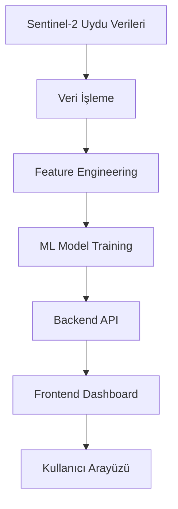

# 🌊 AquaTrack - Akıllı Su Kaynakları İzleme Sistemi

**AquaTrack**, Türkiye'deki göllerin su kalitesi ve su miktarını uydu verileri ve makine öğrenmesi ile izleyen kapsamlı bir analiz platformudur.

## 📋 İçindekiler

- [🎯 Proje Özeti](#-proje-özeti)
- [🏗️ Proje Mimarisi](#️-proje-mimarisi)
- [📊 Veri Kaynakları](#-veri-kaynakları)
- [🚀 Kurulum ve Çalıştırma](#-kurulum-ve-çalıştırma)
- [🔧 API Dokümantasyonu](#-api-dokümantasyonu)
- [📱 Frontend Kullanımı](#-frontend-kullanımı)
- [🤖 Makine Öğrenmesi Modelleri](#-makine-öğrenmesi-modelleri)
- [📈 Veri Görselleştirme](#-veri-görselleştirme)
- [🛠️ Geliştirme Rehberi](#️-geliştirme-rehberi)
- [📞 Destek](#-destek)

---

## 🎯 Proje Özeti

### 🌟 Özellikler

- **🔍 Su Kalitesi Analizi**: NDWI, Chl-a, Turbidity, WRI parametreleri ile K-Means clustering
- **📊 Su Miktarı Tahmini**: CatBoost modelleri ile 1-3 aylık tahminler
- **🗺️ İnteraktif Haritalar**: 7 gölün gerçek zamanlı durumu
- **📈 Görselleştirme**: Nivo Circle Packing, Recharts, ECharts entegrasyonu
- **🎨 Modern UI**: Responsive tasarım ve profesyonel arayüz
- **🔒 Güvenlik**: Rate limiting, input validation, error handling

### 🏞️ İzlenen Göller

1. **Van Gölü** (ID: 141)
2. **Tuz Gölü** (ID: 140)
3. **Burdur Gölü** (ID: 1342)
4. **Eğirdir Gölü** (ID: 1340)
5. **Ulubat Gölü** (ID: 1321)
6. **Sapanca Gölü** (ID: 14510)
7. **Salda Gölü** (ID: 14741)

---

## 🏗️ Proje Mimarisi

```
proje_aqua/
├── 📁 backend/                 # Flask API Server
│   ├── 📁 models/             # ML Models & Data
│   ├── 📁 routes/             # API Endpoints
│   ├── 📁 security/           # Security Modules
│   └── 📄 app.py             # Main Application
├── 📁 frontend/               # React Frontend
│   ├── 📁 src/
│   │   ├── 📁 components/     # React Components
│   │   ├── 📁 pages/          # Page Components
│   │   └── 📁 config/         # Configuration
│   ├── 📄 USAGE_GUIDE.md     # Frontend Kullanım Rehberi
│   └── 📄 package.json
├── 📁 data/                   # Data Sources
│   ├── 📄 clustered_water_quality.csv
│   └── 📁 gol_*/             # Lake-specific data
├── 📁 training/               # Tüm Eğitim Dosyaları
│   ├── 📁 water_quality/      # Su kalitesi eğitim scriptleri
│   ├── 📁 water_quantity/     # Su miktarı eğitim scriptleri
│   └── 📄 *.py               # Python eğitim dosyaları
├── 📁 outputs/                # Tüm Çıktılar
│   ├── 📁 models_optuna/      # Model performans çıktıları
│   ├── 📁 predictions/        # Tahmin sonuçları
│   └── 📄 *.csv, *.json      # Analiz çıktıları
└── 📄 data_sources_config.py  # Centralized Config
```

### 🔄 Veri Akışı



---

## 📊 Veri Kaynakları

### 🌊 Su Kalitesi Verileri
- **Kaynak**: `data/clustered_water_quality.csv`
- **Parametreler**: NDWI, Chl-a, Turbidity, WRI
- **Tarih Aralığı**: 2018-2024
- **Model**: K-Means Clustering (4 cluster)

### 💧 Su Miktarı Verileri
- **Kaynak**: `backend/models/*.parquet`
- **Model**: CatBoost Regressor (H1, H2, H3 horizons)
- **Tahmin Süresi**: 1-3 ay
- **Doğruluk**: %85+ WMAPE

---

## 🚀 Kurulum ve Çalıştırma

Detaylı kurulum rehberi için [INSTALLATION_GUIDE.md](INSTALLATION_GUIDE.md) dosyasını inceleyin.

### 📋 Temel Gereksinimler

- **Python**: 3.10+
- **Node.js**: 16+
- **npm**: 8+

### 🔧 Hızlı Kurulum

```bash
# 1. Projeyi indir
git clone <repository-url>
cd proje_aqua

# 2. Backend kurulumu
python -m venv venv
venv\Scripts\activate  # Windows
pip install flask flask-cors pandas numpy scikit-learn catboost xgboost

# 3. Frontend kurulumu
cd frontend
npm install

# 4. Veri kontrolü
cd ..
python data_sources_config.py

# 5. Çalıştır
# Terminal 1: cd backend && python app.py
# Terminal 2: cd frontend && npm run dev
```

---

## 🔧 API Dokümantasyonu

Detaylı API dokümantasyonu için [API_DOCUMENTATION.md](API_DOCUMENTATION.md) dosyasını inceleyin.

### 🌊 Ana Endpoints

- **Su Kalitesi**: `/api/quality/*`
- **Su Miktarı**: `/api/forecast/*`
- **Sistem**: `/api/system/*`

### 🔗 Temel API Çağrıları

```bash
# Sistem durumu
GET http://127.0.0.1:5000/api/quality/status

# Göl detay analizi
GET http://127.0.0.1:5000/api/quality/lake/van/cluster

# Su miktarı tahminleri
GET http://127.0.0.1:5000/api/forecast/lake/141/predictions
```

---

## 📱 Frontend Kullanımı

Frontend kullanımı ve özellikler için [frontend/USAGE_GUIDE.md](frontend/USAGE_GUIDE.md) dosyasını inceleyin.

---

## 🤖 Makine Öğrenmesi Modelleri

### 🌊 Su Kalitesi Modelleri

#### K-Means Clustering
- **Amaç**: Su kalitesi sınıflandırması
- **Parametreler**: NDWI, Chl-a, Turbidity, WRI
- **Cluster Sayısı**: 4
- **Cluster Anlamları**:
  - **Cluster 0** (Yeşil): Normal kalite
  - **Cluster 1** (Kırmızı): Alg patlaması
  - **Cluster 2** (Sarı): Tuzluluk artışı
  - **Cluster 3** (Mavi): Özel durumlar

#### XGBoost Classifier
- **Amaç**: Cluster tahmini
- **Doğruluk**: %92+
- **Özellikler**: 4 parametre + tarih bilgisi

### 💧 Su Miktarı Modelleri

#### CatBoost Regressor
- **Horizon H1**: 1 aylık tahmin
- **Horizon H2**: 2 aylık tahmin  
- **Horizon H3**: 3 aylık tahmin
- **Doğruluk**: %85+ WMAPE
- **Özellikler**: NDWI, tarih, mevsim

---

## 📈 Veri Görselleştirme

### 🎨 Kullanılan Kütüphaneler

#### Recharts
- **BarChart**: Su miktarı karşılaştırmaları
- **LineChart**: Trend analizleri
- **RadarChart**: Çok boyutlu analiz
- **RadialBarChart**: Model performansları
- **PieChart**: Cluster dağılımları

#### Nivo
- **CirclePacking**: Hiyerarşik veri görünümü
- **Responsive**: Otomatik boyutlandırma
- **Interaktif**: Hover ve click olayları

### 🎯 Görselleştirme Özellikleri

- **Responsive Design**: Tüm ekran boyutları
- **Renk Kodlaması**: Anlamlı renk paleti
- **Animasyonlar**: Smooth geçişler
- **Tooltip'ler**: Detaylı bilgi gösterimi
- **Legend'lar**: Açıklayıcı etiketler

---

## 🛠️ Geliştirme Rehberi

### 📁 Proje Yapısı

#### Backend Geliştirme
```bash
backend/
├── routes/           # API endpoint'leri
├── models/          # ML model yönetimi
├── security/        # Güvenlik modülleri
├── utils.py         # Yardımcı fonksiyonlar
└── app.py          # Ana uygulama
```

#### Frontend Geliştirme
```bash
frontend/src/
├── components/      # Yeniden kullanılabilir bileşenler
├── pages/          # Sayfa bileşenleri
├── config/         # Konfigürasyon dosyaları
├── hooks/          # Custom React hooks
└── constants/      # Sabit değerler
```

### 🔧 Yeni Özellik Ekleme

#### 1. Backend API Endpoint
```python
# routes/new_feature_routes.py
from flask import Blueprint, jsonify

new_feature_bp = Blueprint('new_feature', __name__)

@new_feature_bp.route("/api/new-feature/data", methods=["GET"])
def get_new_feature_data():
    # API logic here
    return jsonify({"status": "success", "data": []})
```

#### 2. Frontend Component
```jsx
// src/components/NewFeature.jsx
import React, { useState, useEffect } from 'react'

const NewFeature = () => {
  const [data, setData] = useState([])
  
  useEffect(() => {
    // Fetch data from API
  }, [])
  
  return (
    <div>
      {/* Component JSX */}
    </div>
  )
}

export default NewFeature
```

### 🧪 Test Etme

#### Backend Test
```bash
# API endpoint'lerini test et
curl -X GET http://127.0.0.1:5000/api/quality/status
```

#### Frontend Test
```bash
# Frontend'i test modunda çalıştır
cd frontend
npm run dev
```

### 📊 Veri Kaynağı Ekleme

#### 1. Konfigürasyon Güncelleme
```python
# data_sources_config.py
NEW_DATA_SOURCE = {
    "csv_file": PROJECT_ROOT / "data" / "new_data.csv",
    "endpoints": {
        "new_endpoint": "/api/new-endpoint"
    }
}
```

#### 2. Backend Route Ekleme
```python
# routes/new_data_routes.py
from data_sources_config import NEW_DATA_SOURCE

@new_data_bp.route(NEW_DATA_SOURCE["endpoints"]["new_endpoint"])
def get_new_data():
    df = pd.read_csv(NEW_DATA_SOURCE["csv_file"])
    # Process data
    return jsonify({"status": "success", "data": processed_data})
```

---

## 🔍 Sorun Giderme

### ❌ Yaygın Sorunlar

#### 1. Backend Başlamıyor
```bash
# Hata: ModuleNotFoundError
pip install -r requirements.txt

# Hata: Port already in use
netstat -ano | findstr :5000
taskkill /PID <PID> /F
```

#### 2. Frontend Başlamıyor
```bash
# Hata: Missing script "start"
cd frontend
npm run dev

# Hata: Module not found
rm -rf node_modules package-lock.json
npm install
```

#### 3. Veri Bulunamıyor
```bash
# Veri kaynaklarını kontrol et
python data_sources_config.py

# CSV dosyalarını kontrol et
ls -la data/
ls -la backend/models/
```

#### 4. API Bağlantı Hatası
```bash
# Backend çalışıyor mu?
curl http://127.0.0.1:5000/api/quality/status

# CORS hatası
# backend/app.py'de CORS ayarlarını kontrol et
```

### 🔧 Debug Modu

#### Backend Debug
```python
# app.py
app.config['DEBUG'] = True
app.run(debug=True)
```

#### Frontend Debug
```bash
# Console'da hata mesajlarını kontrol et
F12 → Console tab
```

---

## 📊 Performans Optimizasyonu

### ⚡ Backend Optimizasyonu

- **Model Caching**: ML modelleri bellekte tutulur
- **Data Preprocessing**: Veriler önceden işlenir
- **API Response Caching**: Sık kullanılan endpoint'ler cache'lenir

### 🎨 Frontend Optimizasyonu

- **Lazy Loading**: Sayfalar gerektiğinde yüklenir
- **Component Memoization**: React.memo kullanımı
- **Image Optimization**: Görsel dosyalar optimize edilir

---

## 🔒 Güvenlik

### 🛡️ Backend Güvenlik

- **Rate Limiting**: API çağrı limitleri
- **Input Validation**: Girdi doğrulama
- **Error Handling**: Güvenli hata yönetimi
- **CORS**: Cross-origin ayarları

### 🔐 Frontend Güvenlik

- **XSS Protection**: Cross-site scripting koruması
- **CSRF Protection**: Cross-site request forgery koruması
- **Secure Headers**: Güvenli HTTP başlıkları

---

## 📈 Gelecek Planları

### 🚀 Kısa Vadeli (1-3 ay)
- [ ] Real-time data streaming
- [ ] Mobile app development
- [ ] Advanced ML models (LSTM, Transformer)
- [ ] Multi-language support

### 🌟 Uzun Vadeli (6-12 ay)
- [ ] IoT sensor integration
- [ ] Predictive maintenance
- [ ] Climate change analysis
- [ ] Water quality forecasting

---

## 📞 Destek

### 🆘 Yardım Alma

1. **GitHub Issues**: Teknik sorunlar için
2. **Documentation**: Bu README dosyası
3. **Code Comments**: Kod içi açıklamalar
4. **API Docs**: Endpoint dokümantasyonu

### 👥 Katkıda Bulunma

1. **Fork** projeyi
2. **Feature branch** oluşturun (`git checkout -b feature/amazing-feature`)
3. **Commit** değişikliklerinizi (`git commit -m 'Add amazing feature'`)
4. **Push** branch'inizi (`git push origin feature/amazing-feature`)
5. **Pull Request** açın

### 📝 Lisans

Bu proje MIT lisansı altında lisanslanmıştır. Detaylar için `LICENSE` dosyasına bakın.

---

## 🎉 Teşekkürler

AquaTrack projesi, su kaynaklarının korunması ve sürdürülebilir yönetimi için geliştirilmiştir. Projeye katkıda bulunan herkese teşekkürler!

**🌊 Su kaynaklarımızı koruyalım, geleceğimizi kurtaralım! 🌍**

---

*Son güncelleme: Ekim 2025*
*Versiyon: 2.0.0*